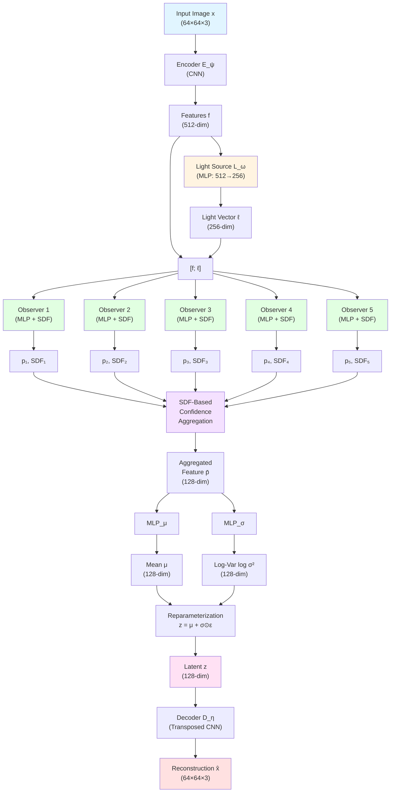

```mermaid
graph TB
    Input["Input Image x<br/>(64×64×3)"] --> Encoder["Encoder E_ψ<br/>(CNN)"]
    Encoder --> Features["Features f<br/>(512-dim)"]

    Features --> LightSource["Light Source L_ω<br/>(MLP: 512→256)"]
    LightSource --> Light["Light Vector ℓ<br/>(256-dim)"]

    Features --> Concat1["[f; ℓ]"]
    Light --> Concat1

    Concat1 --> Obs1["Observer 1<br/>(MLP + SDF)"]
    Concat1 --> Obs2["Observer 2<br/>(MLP + SDF)"]
    Concat1 --> Obs3["Observer 3<br/>(MLP + SDF)"]
    Concat1 --> Obs4["Observer 4<br/>(MLP + SDF)"]
    Concat1 --> Obs5["Observer 5<br/>(MLP + SDF)"]

    Obs1 --> P1["p₁, SDF₁"]
    Obs2 --> P2["p₂, SDF₂"]
    Obs3 --> P3["p₃, SDF₃"]
    Obs4 --> P4["p₄, SDF₄"]
    Obs5 --> P5["p₅, SDF₅"]

    P1 --> Agg["SDF-Based<br/>Confidence<br/>Aggregation"]
    P2 --> Agg
    P3 --> Agg
    P4 --> Agg
    P5 --> Agg

    Agg --> AggFeat["Aggregated<br/>Feature p̄<br/>(128-dim)"]

    AggFeat --> MuMLP["MLP_μ"]
    AggFeat --> SigmaMLP["MLP_σ"]

    MuMLP --> Mu["Mean μ<br/>(128-dim)"]
    SigmaMLP --> LogVar["Log-Var log σ²<br/>(128-dim)"]

    Mu --> Reparam["Reparameterization<br/>z = μ + σ⊙ε"]
    LogVar --> Reparam

    Reparam --> Latent["Latent z<br/>(128-dim)"]

    Latent --> Decoder["Decoder D_η<br/>(Transposed CNN)"]

    Decoder --> Output["Reconstruction x̂<br/>(64×64×3)"]

    style Input fill:#e1f5ff
    style Output fill:#ffe1e1
    style LightSource fill:#fff4e1
    style Obs1 fill:#e1ffe1
    style Obs2 fill:#e1ffe1
    style Obs3 fill:#e1ffe1
    style Obs4 fill:#e1ffe1
    style Obs5 fill:#e1ffe1
    style Agg fill:#f4e1ff
    style Latent fill:#ffe1f4
```
