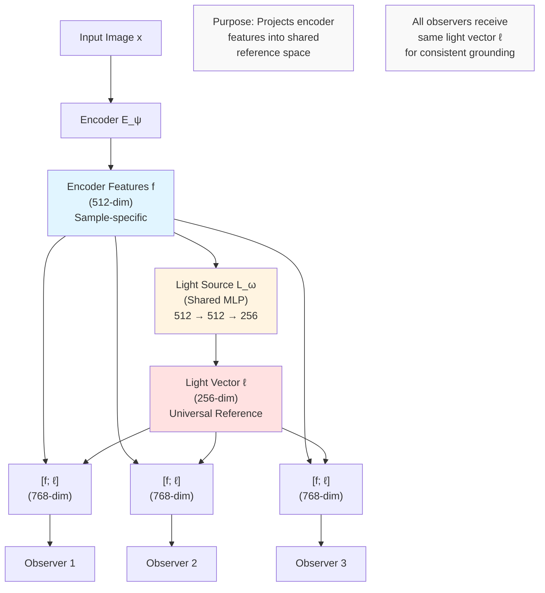

```mermaid
graph TB
    Input["Input Image x"] --> Encoder["Encoder E_ψ"]
    Encoder --> F["Encoder Features f<br/>(512-dim)<br/>Sample-specific"]

    F --> Light["Light Source L_ω<br/>(Shared MLP)<br/>512 → 512 → 256"]

    Light --> L["Light Vector ℓ<br/>(256-dim)<br/>Universal Reference"]

    F --> O1Input["[f; ℓ]<br/>(768-dim)"]
    L --> O1Input

    F --> O2Input["[f; ℓ]<br/>(768-dim)"]
    L --> O2Input

    F --> O3Input["[f; ℓ]<br/>(768-dim)"]
    L --> O3Input

    O1Input --> Observer1["Observer 1"]
    O2Input --> Observer2["Observer 2"]
    O3Input --> Observer3["Observer 3"]

    Note1["Purpose: Projects encoder<br/>features into shared<br/>reference space"]
    Note2["All observers receive<br/>same light vector ℓ<br/>for consistent grounding"]

    style Light fill:#fff4e1
    style L fill:#ffe1e1
    style F fill:#e1f5ff
    style Note1 fill:#f9f9f9
    style Note2 fill:#f9f9f9
```
