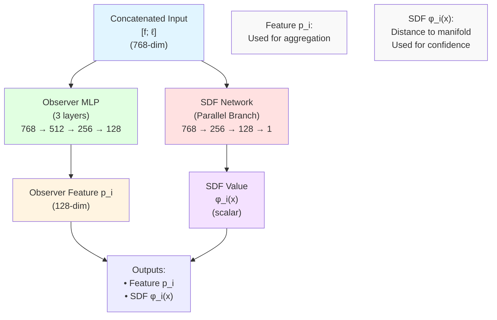

```mermaid
graph TB
    Input["Concatenated Input<br/>[f; ℓ]<br/>(768-dim)"] --> MLP["Observer MLP<br/>(3 layers)<br/>768 → 512 → 256 → 128"]

    MLP --> Feature["Observer Feature p_i<br/>(128-dim)"]

    Input --> SDFBranch["SDF Network<br/>(Parallel Branch)<br/>768 → 256 → 128 → 1"]

    SDFBranch --> SDF["SDF Value<br/>φ_i(x)<br/>(scalar)"]

    Feature --> Outputs["Outputs:<br/>• Feature p_i<br/>• SDF φ_i(x)"]
    SDF --> Outputs

    Note1["Feature p_i:<br/>Used for aggregation"]
    Note2["SDF φ_i(x):<br/>Distance to manifold<br/>Used for confidence"]

    style Input fill:#e1f5ff
    style MLP fill:#e1ffe1
    style SDFBranch fill:#ffe1e1
    style Feature fill:#fff4e1
    style SDF fill:#f4e1ff
    style Note1 fill:#f9f9f9
    style Note2 fill:#f9f9f9
```
