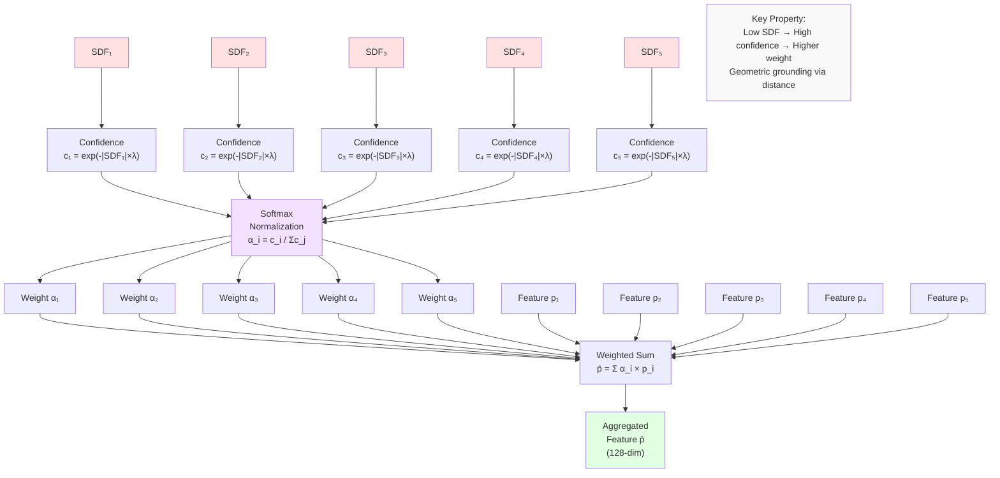

```mermaid
graph TB
    SDF1["SDF₁"] --> Conf1["Confidence<br/>c₁ = exp(-|SDF₁|×λ)"]
    SDF2["SDF₂"] --> Conf2["Confidence<br/>c₂ = exp(-|SDF₂|×λ)"]
    SDF3["SDF₃"] --> Conf3["Confidence<br/>c₃ = exp(-|SDF₃|×λ)"]
    SDF4["SDF₄"] --> Conf4["Confidence<br/>c₄ = exp(-|SDF₄|×λ)"]
    SDF5["SDF₅"] --> Conf5["Confidence<br/>c₅ = exp(-|SDF₅|×λ)"]

    Conf1 --> Softmax["Softmax<br/>Normalization<br/>α_i = c_i / Σc_j"]
    Conf2 --> Softmax
    Conf3 --> Softmax
    Conf4 --> Softmax
    Conf5 --> Softmax

    Softmax --> W1["Weight α₁"]
    Softmax --> W2["Weight α₂"]
    Softmax --> W3["Weight α₃"]
    Softmax --> W4["Weight α₄"]
    Softmax --> W5["Weight α₅"]

    W1 --> WSum["Weighted Sum<br/>p̄ = Σ α_i × p_i"]
    W2 --> WSum
    W3 --> WSum
    W4 --> WSum
    W5 --> WSum

    P1["Feature p₁"] --> WSum
    P2["Feature p₂"] --> WSum
    P3["Feature p₃"] --> WSum
    P4["Feature p₄"] --> WSum
    P5["Feature p₅"] --> WSum

    WSum --> AggFeature["Aggregated<br/>Feature p̄<br/>(128-dim)"]

    Note["Key Property:<br/>Low SDF → High confidence → Higher weight<br/>Geometric grounding via distance"]

    style SDF1 fill:#ffe1e1
    style SDF2 fill:#ffe1e1
    style SDF3 fill:#ffe1e1
    style SDF4 fill:#ffe1e1
    style SDF5 fill:#ffe1e1
    style Softmax fill:#f4e1ff
    style AggFeature fill:#e1ffe1
    style Note fill:#f9f9f9
```
