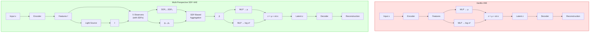

```mermaid
graph TB
    subgraph VanillaVAE["Vanilla VAE"]
        V_Input["Input x"] --> V_Encoder["Encoder"]
        V_Encoder --> V_Features["Features"]
        V_Features --> V_Mu["MLP → μ"]
        V_Features --> V_Sigma["MLP → log σ²"]
        V_Mu --> V_Reparam["z = μ + σ⊙ε"]
        V_Sigma --> V_Reparam
        V_Reparam --> V_Latent["Latent z"]
        V_Latent --> V_Decoder["Decoder"]
        V_Decoder --> V_Output["Reconstruction"]
    end

    subgraph SDFVAE["Multi-Perspective SDF-VAE"]
        S_Input["Input x"] --> S_Encoder["Encoder"]
        S_Encoder --> S_Features["Features f"]
        S_Features --> S_Light["Light Source"]
        S_Light --> S_LightVec["ℓ"]
        S_Features --> S_Obs["5 Observers<br/>(with SDFs)"]
        S_LightVec --> S_Obs
        S_Obs --> S_SDFs["SDF₁...SDF₅"]
        S_Obs --> S_Feats["p₁...p₅"]
        S_SDFs --> S_Agg["SDF-Based<br/>Aggregation"]
        S_Feats --> S_Agg
        S_Agg --> S_AggFeat["p̄"]
        S_AggFeat --> S_Mu["MLP → μ"]
        S_AggFeat --> S_Sigma["MLP → log σ²"]
        S_Mu --> S_Reparam["z = μ + σ⊙ε"]
        S_Sigma --> S_Reparam
        S_Reparam --> S_Latent["Latent z"]
        S_Latent --> S_Decoder["Decoder"]
        S_Decoder --> S_Output["Reconstruction"]
    end

    style VanillaVAE fill:#ffe1e1,stroke:#cc0000
    style SDFVAE fill:#e1ffe1,stroke:#00cc00
```
