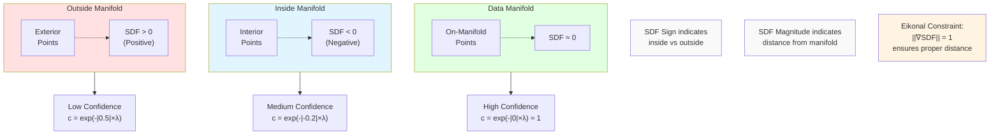

```mermaid
graph TB
    subgraph Manifold["Data Manifold"]
        M1["On-Manifold<br/>Points"]
        M2["SDF ≈ 0"]
        M1 -.-> M2
    end

    subgraph Inside["Inside Manifold"]
        I1["Interior<br/>Points"]
        I2["SDF < 0<br/>(Negative)"]
        I1 -.-> I2
    end

    subgraph Outside["Outside Manifold"]
        O1["Exterior<br/>Points"]
        O2["SDF > 0<br/>(Positive)"]
        O1 -.-> O2
    end

    Manifold --> Confidence1["High Confidence<br/>c = exp(-|0|×λ) ≈ 1"]
    Inside --> Confidence2["Medium Confidence<br/>c = exp(-|-0.2|×λ)"]
    Outside --> Confidence3["Low Confidence<br/>c = exp(-|0.5|×λ)"]

    Note1["SDF Sign indicates<br/>inside vs outside"]
    Note2["SDF Magnitude indicates<br/>distance from manifold"]
    Note3["Eikonal Constraint:<br/>||∇SDF|| = 1<br/>ensures proper distance"]

    style Manifold fill:#e1ffe1
    style Inside fill:#e1f5ff
    style Outside fill:#ffe1e1
    style Note1 fill:#f9f9f9
    style Note2 fill:#f9f9f9
    style Note3 fill:#fff4e1
```
