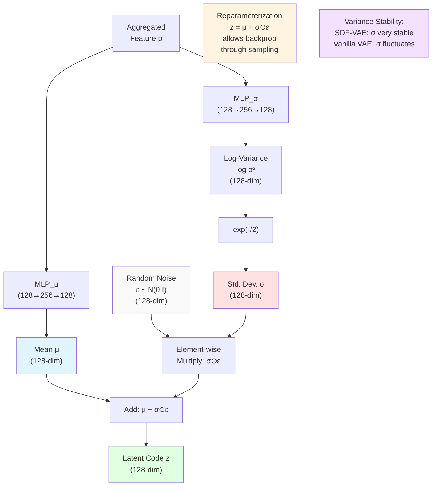

```mermaid
graph TB
    Input["Aggregated<br/>Feature p̄"] --> MuMLP["MLP_μ<br/>(128→256→128)"]
    Input --> SigmaMLP["MLP_σ<br/>(128→256→128)"]

    MuMLP --> Mu["Mean μ<br/>(128-dim)"]
    SigmaMLP --> LogVar["Log-Variance<br/>log σ²<br/>(128-dim)"]

    LogVar --> Exp["exp(·/2)"]
    Exp --> Sigma["Std. Dev. σ<br/>(128-dim)"]

    Epsilon["Random Noise<br/>ε ~ N(0,I)<br/>(128-dim)"] --> Multiply["Element-wise<br/>Multiply: σ⊙ε"]
    Sigma --> Multiply

    Mu --> Add["Add: μ + σ⊙ε"]
    Multiply --> Add

    Add --> Latent["Latent Code z<br/>(128-dim)"]

    Note1["Reparameterization<br/>z = μ + σ⊙ε<br/>allows backprop<br/>through sampling"]
    Note2["Variance Stability:<br/>SDF-VAE: σ very stable<br/>Vanilla VAE: σ fluctuates"]

    style Mu fill:#e1f5ff
    style Sigma fill:#ffe1e1
    style Latent fill:#e1ffe1
    style Epsilon fill:#f9f9f9
    style Note1 fill:#fff4e1
    style Note2 fill:#f4e1ff
```
