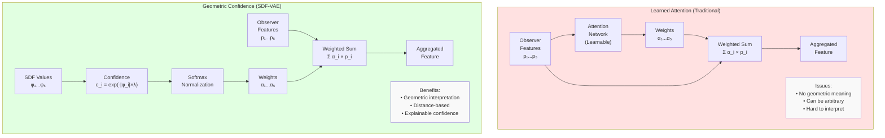

```mermaid
graph TB
    subgraph Learned["Learned Attention (Traditional)"]
        L_Features["Observer<br/>Features<br/>p₁...p₅"] --> L_Attn["Attention<br/>Network<br/>(Learnable)"]
        L_Attn --> L_Weights["Weights<br/>α₁...α₅"]
        L_Weights --> L_Agg["Weighted Sum<br/>Σ α_i × p_i"]
        L_Features --> L_Agg
        L_Agg --> L_Output["Aggregated<br/>Feature"]
        L_Note["Issues:<br/>• No geometric meaning<br/>• Can be arbitrary<br/>• Hard to interpret"]
    end

    subgraph Geometric["Geometric Confidence (SDF-VAE)"]
        G_SDFs["SDF Values<br/>φ₁...φ₅"] --> G_Conf["Confidence<br/>c_i = exp(-|φ_i|×λ)"]
        G_Conf --> G_Softmax["Softmax<br/>Normalization"]
        G_Softmax --> G_Weights["Weights<br/>α₁...α₅"]
        G_Features["Observer<br/>Features<br/>p₁...p₅"] --> G_Agg["Weighted Sum<br/>Σ α_i × p_i"]
        G_Weights --> G_Agg
        G_Agg --> G_Output["Aggregated<br/>Feature"]
        G_Note["Benefits:<br/>• Geometric interpretation<br/>• Distance-based<br/>• Explainable confidence"]
    end

    style Learned fill:#ffe1e1
    style Geometric fill:#e1ffe1
    style L_Note fill:#f9f9f9
    style G_Note fill:#f9f9f9
```
