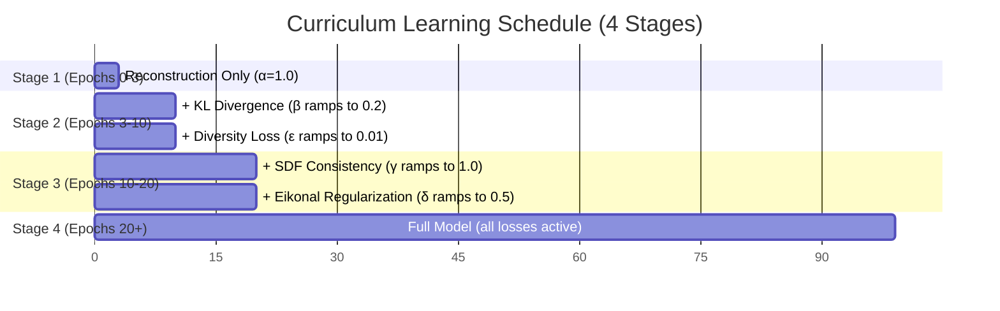

```mermaid
gantt
    title Curriculum Learning Schedule (4 Stages)
    dateFormat X
    axisFormat %s

    section Stage 1 (Epochs 0-3)
    Reconstruction Only (α=1.0) :0, 3

    section Stage 2 (Epochs 3-10)
    + KL Divergence (β ramps to 0.2) :3, 10
    + Diversity Loss (ε ramps to 0.01) :3, 10

    section Stage 3 (Epochs 10-20)
    + SDF Consistency (γ ramps to 1.0) :10, 20
    + Eikonal Regularization (δ ramps to 0.5) :10, 20

    section Stage 4 (Epochs 20+)
    Full Model (all losses active) :20, 99
```
