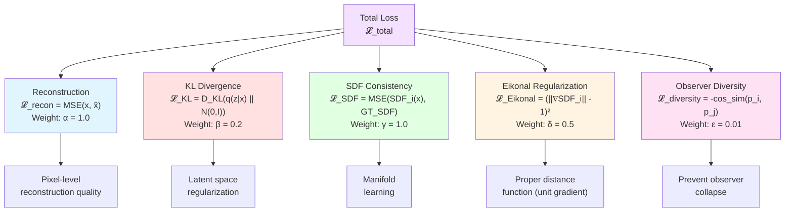

```mermaid
graph TB
    Total["Total Loss<br/>𝓛_total"] --> Recon["Reconstruction<br/>𝓛_recon = MSE(x, x̂)<br/>Weight: α = 1.0"]
    Total --> KL["KL Divergence<br/>𝓛_KL = D_KL(q(z|x) || N(0,I))<br/>Weight: β = 0.2"]
    Total --> SDFConsist["SDF Consistency<br/>𝓛_SDF = MSE(SDF_i(x), GT_SDF)<br/>Weight: γ = 1.0"]
    Total --> Eikonal["Eikonal Regularization<br/>𝓛_Eikonal = (||∇SDF_i|| - 1)²<br/>Weight: δ = 0.5"]
    Total --> Diversity["Observer Diversity<br/>𝓛_diversity = -cos_sim(p_i, p_j)<br/>Weight: ε = 0.01"]

    Recon --> Purpose1["Pixel-level<br/>reconstruction quality"]
    KL --> Purpose2["Latent space<br/>regularization"]
    SDFConsist --> Purpose3["Manifold<br/>learning"]
    Eikonal --> Purpose4["Proper distance<br/>function (unit gradient)"]
    Diversity --> Purpose5["Prevent observer<br/>collapse"]

    style Total fill:#f4e1ff
    style Recon fill:#e1f5ff
    style KL fill:#ffe1e1
    style SDFConsist fill:#e1ffe1
    style Eikonal fill:#fff4e1
    style Diversity fill:#ffe1f4
```
