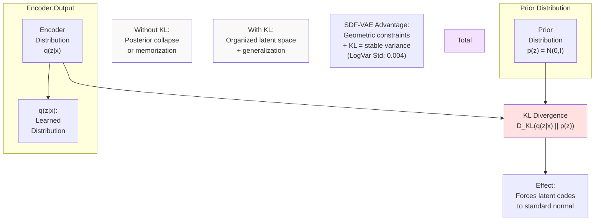

```mermaid
graph TB
    subgraph Encoder["Encoder Output"]
        E1["Input x"] --> E2["q(z|x):<br/>Learned<br/>Distribution"]
    end

    subgraph Prior["Prior Distribution"]
        P1["Target:<br/>N(0, I)<br/>Standard Normal"]
    end

    E1["Encoder<br/>Distribution<br/>q(z|x)"] --> KL["KL Divergence<br/>D_KL(q(z|x) || p(z))"]
    P1["Prior<br/>Distribution<br/>p(z) = N(0,I)"] --> KL

    KL --> Effect["Effect:<br/>Forces latent codes<br/>to standard normal"]

    Note1["Without KL:<br/>Posterior collapse<br/>or memorization"]
    Note2["With KL:<br/>Organized latent space<br/>+ generalization"]
    Note3["SDF-VAE Advantage:<br/>Geometric constraints<br/>+ KL = stable variance<br/>(LogVar Std: 0.004)"]

    style Total fill:#f4e1ff
    style KL fill:#ffe1e1
    style Note1 fill:#f9f9f9
    style Note2 fill:#f9f9f9
```
