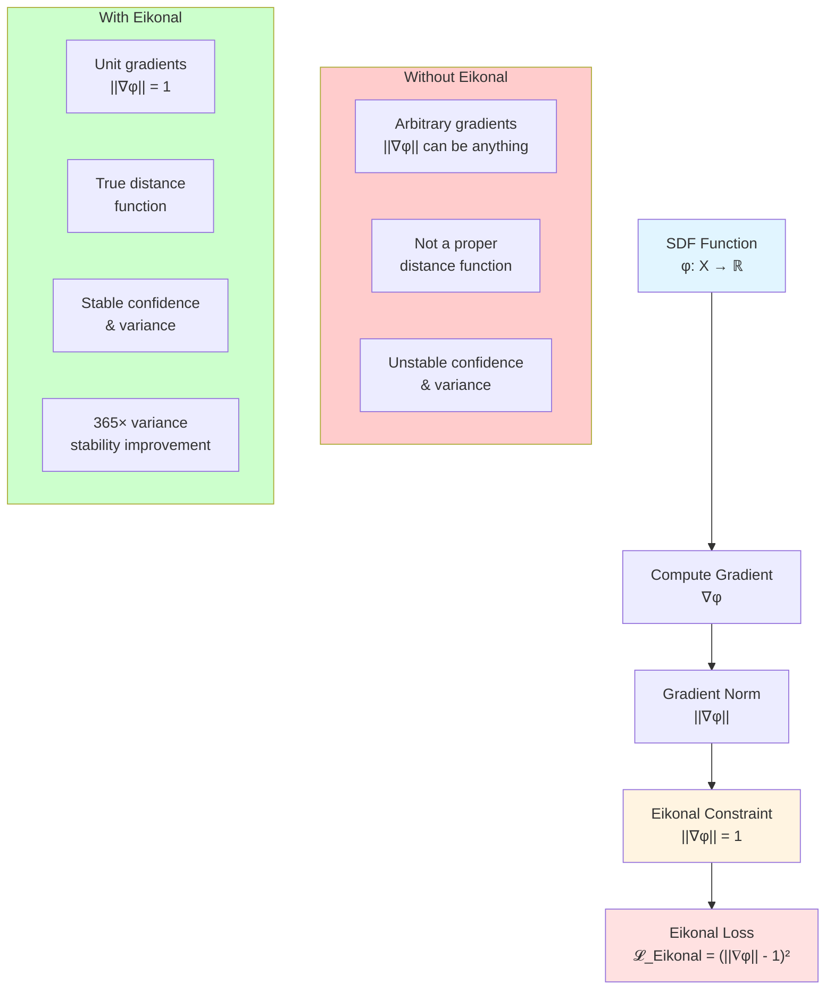

```mermaid
graph TB
    SDF["SDF Function<br/>φ: X → ℝ"] --> Gradient["Compute Gradient<br/>∇φ"]

    Gradient --> Norm["Gradient Norm<br/>||∇φ||"]

    Norm --> Constraint["Eikonal Constraint<br/>||∇φ|| = 1"]

    Constraint --> Loss["Eikonal Loss<br/>𝓛_Eikonal = (||∇φ|| - 1)²"]

    subgraph Without["Without Eikonal"]
        W1["Arbitrary gradients<br/>||∇φ|| can be anything"]
        W2["Not a proper<br/>distance function"]
        W3["Unstable confidence<br/>& variance"]
    end

    subgraph With["With Eikonal"]
        Wi1["Unit gradients<br/>||∇φ|| = 1"]
        Wi2["True distance<br/>function"]
        Wi3["Stable confidence<br/>& variance"]
        Wi4["365× variance<br/>stability improvement"]
    end

    style SDF fill:#e1f5ff
    style Constraint fill:#fff4e1
    style Loss fill:#ffe1e1
    style Without fill:#ffcccc
    style With fill:#ccffcc
```
